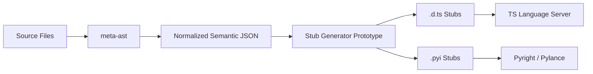

# MetaAST Stub Prototype


> **Disclaimer**: This is an exploratory prototype developed for the MetaCall community. It is not an official integration or a production-ready tool. The goal is to validate architectural assumptions regarding metadata-driven IntelliSense.

## Overview

`meta-ast-stub-prototype` is a minimal proof-of-concept pipeline designed to demonstrate how semantic metadata generated by `meta-ast` can be used to produce editor-compatible IntelliSense stub files (`.d.ts` for TypeScript and `.pyi` for Python).

## Why This Exists

The current IntelliSense proof-of-concept for MetaCall relies on runtime introspection or language-specific parsers operating in the editor extension. This approach is hard to scale to $N$ languages.

This prototype validates a **static-analysis-driven workflow**:
- Semantic intelligence lives in `meta-ast`.
- It produces a normalized schema of exported symbols.
- This prototype consumes that schema and generates native stubs.
- Standard language servers (Pyright, TS Server) consume the stubs.

## What This Is NOT

- A production-ready tool.
- A replacement for full LSP support.
- A complete implementation of MetaCall's type system.

## Architectural Context

Historically, MetaCall's dynamic nature favored runtime reflection for understanding loaded symbols. However, for IDE tooling, static analysis provides a much better developer experience (faster, no need to run code).

By separating the **extraction** of semantics (handled by `meta-ast` via Tree-sitter) from the **consumption** of semantics (handled by generated stubs in the editor), we keep the editor extensions thin and highly performant.

## Architecture Summary



## Example Input

The prototype consumes a simplified representation of what `meta-ast` produces:

```json
{
  "funcs": [
    {
      "name": "sum",
      "args": [
        {"name": "a", "type": "number"},
        {"name": "b", "type": "number"}
      ],
      "ret": {"type": "number"},
      "docstring": "Adds two numbers and returns the result."
    }
  ]
}
```

## Key Features

- **Type Normalization Layer**: Decouples source language types from target language representations.
- **Complex Type Support**: Generates TypeScript `interface` and Python `TypedDict` for nested objects.
- **Dependency Graph**: Generates Mermaid and JSON representations of symbol references.
- **Incremental Watch Mode**: Automatically regenerates stubs when metadata changes.
- **CLI Feedback**: Rich terminal output with generation summaries.

## Example Input (Complex Types)

The prototype now handles nested structures:

```json
{
  "name": "getUser",
  "args": [{ "name": "id", "type": "number" }],
  "ret": {
    "type": "object",
    "properties": {
      "id": { "type": "number" },
      "profile": {
        "type": "object",
        "properties": { "name": { "type": "string" } }
      }
    }
  }
}
```

## Generated Outputs

### TypeScript (`metacall.d.ts`)
```typescript
export interface Profile {
  name: string;
}

export interface GetUserResult {
  id: number;
  profile: Profile;
}

export function getUser(id: number): GetUserResult;
```

### Python (`metacall.pyi`)
```python
class Profile(TypedDict):
    name: str

class GetUserResult(TypedDict):
    id: float
    profile: Profile

def getUser(id: float) -> GetUserResult: ...
```

## CLI Usage

```bash
# Single generation run
npm run generate

# Watch mode for real-time regeneration
npm run watch
```

## Loader Type Mapping Exploration

During discussions with MetaCall maintainers, we identified a key architectural challenge: **implicit type conversions inside loaders**. 

- **The Problem:** Mappings between host languages (e.g. Python, Node.js, TypeScript) and the MetaCall Core are hardcoded imperatively (e.g. `if/else` checks inside C/C++ loader files). Because they are not exposed as structured metadata, it is extremely difficult for static analysis tooling, documentation generators, and LSP implementations to query or guarantee type safety across language boundaries.
- **Why This Matters:** Without explicit type mapping metadata, tools must manually duplicate and hardcode conversion logic, leading to structural drift and fragile developer tooling.
- **Future Directions:** We explore three key approaches: exposing mappings dynamically via a new MetaCall Core C API, statically compiling metadata from loader codebase ASTs, and enforcing compile-time consistency checks to guarantee type alignment.

For more details, see our research and architecture logs:
- [Loader Type Mapping Research](docs/TYPE_MAPPING_RESEARCH.md)
- [Loader Type Mapping Architecture Notes](docs/ARCHITECTURE_NOTES.md)

## Documentation

- [Architecture Details](docs/ARCHITECTURE.md) - Pipeline and normalization layer
- [Research Notes](docs/RESEARCH_NOTES.md) - Thoughts on TypedDict, LSP, and Tree-sitter
- [Examples](examples/vscode-validation/) - VS Code validation guide
- [Loader Type Mapping Research](docs/TYPE_MAPPING_RESEARCH.md) - Detailed analysis of Python, Node, and TypeScript loaders
- [Loader Type Mapping Architecture Notes](docs/ARCHITECTURE_NOTES.md) - Tooling, IntelliSense, and documentation implications


