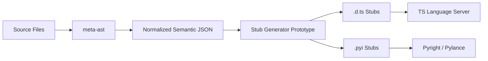

# MetaAST Stub Prototype


> **Disclaimer**: This is an exploratory prototype developed for the MetaCall community. It is not an official integration or a production-ready tool. The goal is to validate architectural assumptions regarding metadata-driven IntelliSense.

## Overview

`meta-ast-stub-prototype` is a minimal proof-of-concept pipeline designed to demonstrate how semantic metadata generated by `meta-ast` can be used to produce editor-compatible IntelliSense stub files (`.d.ts` for TypeScript and `.pyi` for Python).

## Why This Exists

The current IntelliSense proof-of-concept for MetaCall relies on runtime introspection or language-specific parsers operating in the editor extension. This approach is hard to scale to $N$ languages.

This prototype validates a **static-analysis-driven workflow**:
- Semantic intelligence lives in `meta-ast`.
- It produces a normalized schema of exported symbols.
- This prototype consumes that schema and generates native stubs.
- Standard language servers (Pyright, TS Server) consume the stubs.

## What This Is NOT

- A production-ready tool.
- A replacement for full LSP support.
- A complete implementation of MetaCall's type system.

## Architectural Context

Historically, MetaCall's dynamic nature favored runtime reflection for understanding loaded symbols. However, for IDE tooling, static analysis provides a much better developer experience (faster, no need to run code).

By separating the **extraction** of semantics (handled by `meta-ast` via Tree-sitter) from the **consumption** of semantics (handled by generated stubs in the editor), we keep the editor extensions thin and highly performant.

## Architecture Summary



## Example Input

The prototype consumes a simplified representation of what `meta-ast` produces:

```json
{
  "funcs": [
    {
      "name": "sum",
      "args": [
        {"name": "a", "type": "number"},
        {"name": "b", "type": "number"}
      ],
      "ret": {"type": "number"},
      "docstring": "Adds two numbers and returns the result."
    }
  ]
}
```

## Example Generated Outputs

### TypeScript (`metacall.d.ts`)

```typescript
/**
 * Adds two numbers and returns the result.
 */
declare function sum(a: number, b: number): number;
```

### Python (`metacall.pyi`)

```python
def sum(a: int, b: int) -> int: ...
    """Adds two numbers and returns the result."""
```

## CLI Usage

Running the generator produces clean, actionable logs:

```text
[meta-ast-stub-prototype]
✓ Parsed semantic metadata
✓ Generated TypeScript stubs (.d.ts)
✓ Generated Python stubs (.pyi)

Generation summary:
- Functions processed: 4
- Output directory: .../output
```

## Installation

```bash
npm install
```

## Usage

```bash
npm run generate
```

## Documentation

- [Architecture Details](docs/ARCHITECTURE.md)
- [Future Directions](docs/FUTURE_DIRECTIONS.md)
- [Examples](examples/)
