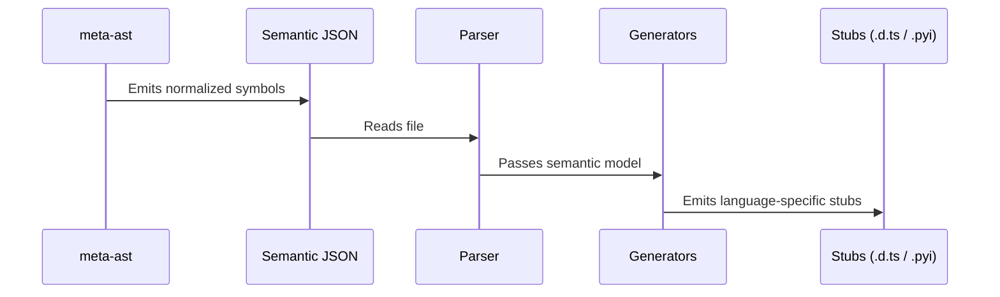

# Architecture: MetaAST Stub Prototype

This document details the architecture of the stub generation prototype and how it fits into the broader MetaCall ecosystem.

## Pipeline Overview

The prototype implements a one-way pipeline from semantic metadata to editor stubs.

## Semantic Metadata Flow

The core concept is that `meta-ast` is the source of truth for code semantics. It parses the source files (Python, JavaScript, etc.) using Tree-sitter and extracts:
- Functions and their signatures.
- Classes, methods, and properties.
- Type annotations (where available).
- Docstrings and comments.

This extraction is complex and language-specific. However, the output is a **normalized symbol model** represented in JSON.

## Generator Architecture

The generator in this prototype is designed to be modular.

- **Parser**: Reads the JSON and constructs the internal TypeScript interfaces.
- **Type Mappings**: A centralized dictionary that knows how to convert a MetaAST type (like `number`) into a TypeScript type (`number`) or a Python type (`int`).
- **Generators**: Independent classes for each target language (`DtsGenerator`, `PyiGenerator`). This ensures that adding support for a new language (e.g., Ruby `.rbi` stubs) only requires adding a new generator class.

## Relation to Normalized Symbol Models

In a full implementation, the metadata would not be a flat list of functions but a **Semantic Graph**. Nodes would represent symbols, and edges would represent references and imports.

The generators would traverse this graph to produce not just flat stub files, but structured directory trees of stubs mimicking the original source structure.

## Future Extension: LSP Integration

While generating files to disk is useful for testing and simple projects, the ultimate goal is to embed this generator logic into a custom **MetaCall Language Server**.

Instead of writing stubs to disk, the server would:
1. Hold the semantic graph in memory.
2. Generate stub content on the fly.
3. Serve it to the editor via standard LSP methods like `textDocument/didOpen` using virtual file URIs.
