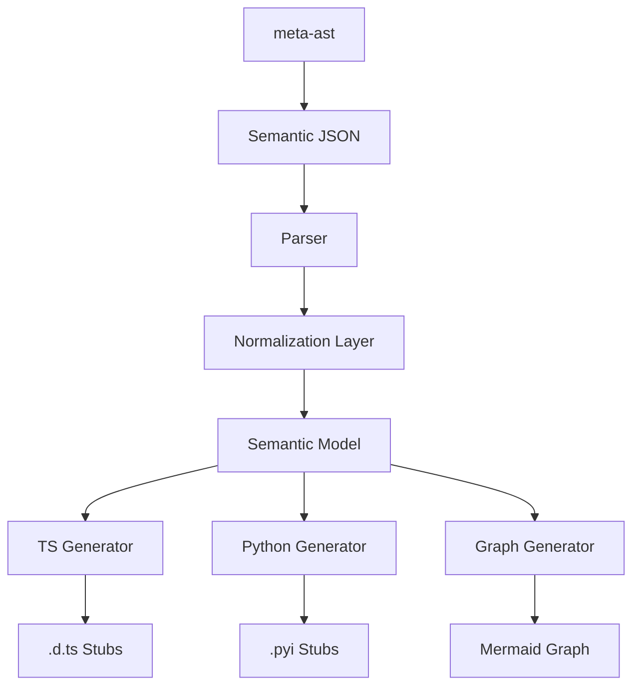

# Architecture: MetaAST Stub Prototype

This document details the architecture of the stub generation prototype and how it fits into the broader MetaCall ecosystem.

## Pipeline Overview

The prototype implements a multi-stage pipeline from semantic metadata to editor stubs and visualizations.

## Type Normalization Layer (`src/normalization/`)

A critical addition is the Type Normalization Layer. Instead of mapping raw strings directly to target languages, we now perform a two-step mapping:

1. **Source to Semantic**: Maps language-specific strings (e.g., `i32`, `float`, `text`) to an internal `SemanticKind` (e.g., `NumericType`, `StringType`).
2. **Semantic to Target**: Maps the `SemanticKind` and its structure (recursive objects, arrays) to target language constructs.

This decoupling allows us to support complex structures like **nested objects** and **recursive types** while keeping the generator logic clean.

## Graph & Reference Tracking

The semantic metadata now includes a `references` array. This transforms the flat function list into a **Semantic Graph**.

- **Node**: A function or symbol.
- **Edge**: A relationship (e.g., `call`, `dependency`, `import`).

The `GraphGenerator` uses this information to produce visualizations, helping developers understand the cross-language call graph at a glance.

## Incremental Regeneration (Watch Mode)

The prototype includes a debounced watch mode (`npm run watch`). This mimics a real development environment where changes to the core semantic model (generated by `meta-ast`) are immediately reflected in the editor stubs.

## Future Extension: LSP Integration

While generating files to disk is useful for testing and simple projects, the ultimate goal is to embed this generator logic into a custom **MetaCall Language Server**.

Instead of writing stubs to disk, the server would:
1. Hold the semantic graph in memory.
2. Generate stub content on the fly.
3. Serve it to the editor via standard LSP methods like `textDocument/didOpen` using virtual file URIs.

