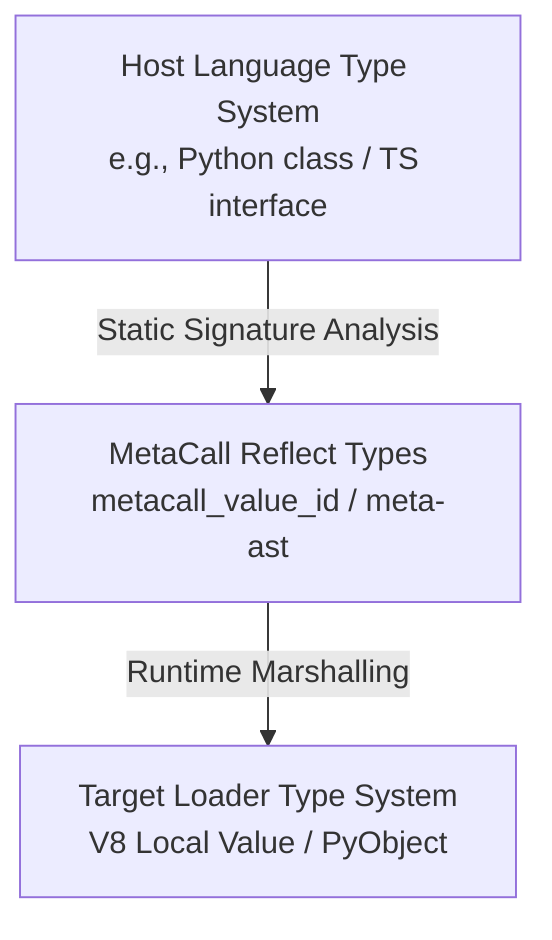

# MetaCall Architecture & Tooling Notes

This document analyzes how MetaCall's type representations impact cross-language stub generation, IntelliSense, compiler guarantees, and developer experience.

---

## 1. Type Layers in the Polyglot Stack

We define three distinct layers of type systems active during a polyglot function invocation:



### A. MetaCall Reflect Types
*   **Definition:** The universal type IDs defined in the core C library (e.g. `METACALL_INT`, `METACALL_STRING`, `METACALL_MAP`).
*   **Role:** Acts as the shared medium of exchange. It is the language-agnostic representation of a type.
*   **Availability:** Accessible at runtime via MetaCall's reflection API (`metacall_value_to_...` and `metacall_inspect`), and at build time via `meta-ast` parsing of exported functions.

### B. Loader Types
*   **Definition:** Runtime wrapper structures specific to a language plugin's embedded engine (e.g. Python's `PyObject *`, Node's `v8::Local<v8::Value>`).
*   **Role:** Translates native CPU pointers and structures into the standard format of the host runtime engine.

### C. Language-Specific High-Level Types
*   **Definition:** TypeScript types (e.g. `Record<string, number>`), Python Type Hints (e.g. `Dict[str, float]`).
*   **Role:** Developer-facing declarations. These are erased at runtime in JS/TS and python, but used extensively by IDEs for static checking.

---

## 2. Cross-Language Declaration Generation

The `meta-ast` tool leverages Reflect Types to generate compile-time declaration stubs (such as `.d.ts` files for TypeScript or `.pyi` files for Python). The goal is to allow a TypeScript file importing a Python script to see proper parameter names and types.

### The Conversion Flow
```
[Python Source] 
    ↓ (parsed by meta-ast / inspect)
[Reflect Types Schema (JSON)] 
    ↓ (translated by meta-ast-stub-prototype)
[TypeScript Declaration (.d.ts)]
```

### The Alignment Challenge
If the generator translates a `METACALL_INT` to `number` in TS, but the Node.js loader implicitly converts `METACALL_INT` to a string in some edge cases (due to an internal runtime fallback), **the compile-time type and runtime behavior will drift**. 

Without structured type mapping metadata, the stub generator is forced to hardcode mappings (such as `METACALL_DOUBLE -> number`), which might not match the actual marshalling behavior of the active loader version.

---

## 3. Tooling and IntelliSense Implications

IDEs (VS Code, WebStorm, PyCharm) rely on static declaration files (`.d.ts`, `.pyi`) to power:
- Autocomplete / IntelliSense
- In-editor type validation (e.g., highlighting that you passed a string to a function expecting a number)
- Inline documentation and parameter signature hints

### The Problem of Implicit Mappings
When mappings are hidden inside C/C++ loader plugins:
1.  **LSP Disconnect:** Language Server Protocol (LSP) implementations for MetaCall cannot verify if a signature generated from Python is safe to use in JavaScript.
2.  **Generic Fallbacks:** Because mappings are not queryable, tools are forced to use loose types like `any` or `unknown` for complex objects, weakening compile-time safety.
3.  **Strict Mode Failures:** TypeScript's `strictNullChecks` or `noImplicitAny` options are difficult to support because the nullability of loader conversions is not explicitly documented.

---

## 4. Documentation Implications

API documentation is often generated from code comments or type declarations. For a polyglot system, we need to generate documentation showing how to call Python APIs from Node.js, and vice-versa.

### The Alignment Solution
If loader mappings are exposed as **Structured Metadata** (e.g. JSON), the documentation generator can compile a unified matrix:

| Source Type (Python) | Core Reflect ID | Target Type (Node.js) | Marshalling Support |
| :--- | :--- | :--- | :--- |
| `float` | `METACALL_DOUBLE` | `number` | Direct (Lossless) |
| `int` | `METACALL_LONG` | `number` | Range-restricted (Lossy > 53 bits) |
| `tuple` | `METACALL_ARRAY` | `any[]` | Mutability Lost |

By keeping mappings in JSON metadata format inside the loaders, we can regenerate this compatibility matrix automatically on every commit, ensuring that documentation never drifts from the actual source code.
